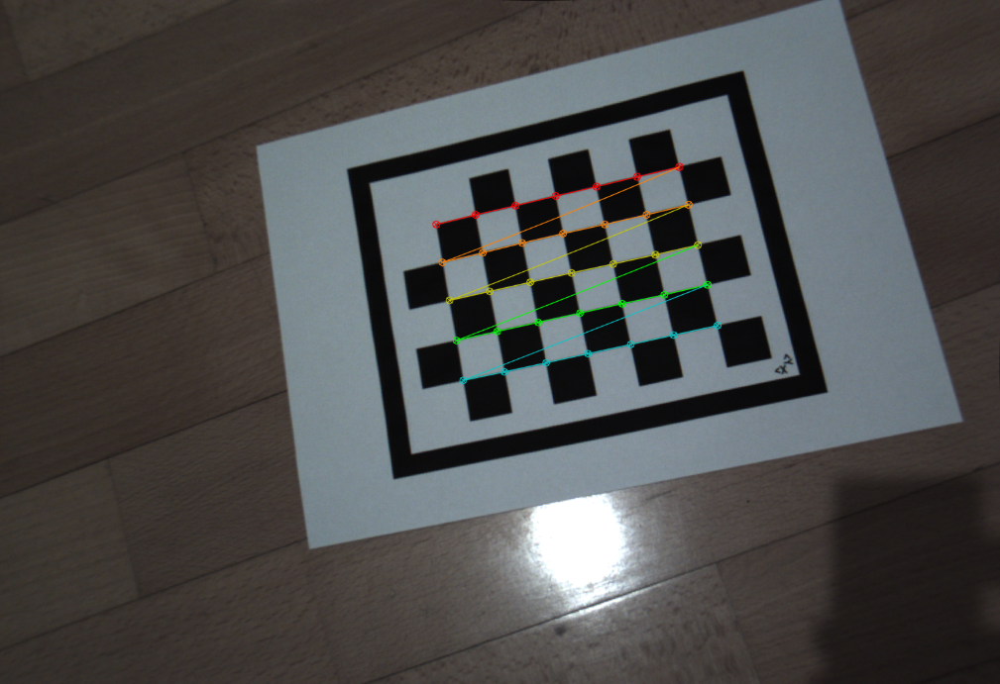

# Computer vision project 2018/2919 @ Unive

## Brief description of the project phases

### Camera calibration
Goes through a set of photos of a referenc chessboard taken from the same camera, and finds the camera parameters that can be used to remove the distortion.



### Planes identification
Identify the horizontal and vertical planes in the video, by looking at the reference picture. Once the planes are identified, the homography can be computed.


### Isolate laser pixels
By combining some filters, in the right color space (in this case HLS), it's possible to isolate the laser pixels.


### 3D reconstruction
Knowing the homography and the set of the laser pixels, it's possible to compute the laser plane.
On the object region some points of the plane will be displaced, and by computing the 3d coordinates of those points, we can generate a point cloud representing the object subject of the scan.


## Seutp
All the code is placed in the python notebook file.
There's an additional script ```./setup.sh``` that will download the files and unzip them in the right folder.
The ```./requirements.txt``` file contains all the necessary libraries to run the project and can be used to create a conda environment.

### Folders structure

All the project input files must be placed under ```./cv2019_data```, and the imamges used for the calibration under ```./cv2019_data/calib```.
A folder ```./res``` is used to save output files and extra files (such as examples of calibration and planes identification)

```sh
├── 3Dscanner.ipynb
├── cv2019_data
│   ├── calib
│   │   └── img_*.png
│   ├── chessboard.pdf
│   ├── chessboard.svg
│   ├── cup1.mp4
│   ├── cup2.mp4
│   ├── plane.pdf
│   ├── plane.svg
│   ├── puppet.mp4
│   └── soap.mp4
├── res
│   ├── calibresult.png
│   ├── params.npz
│   ├── planes_approx.png
│   ├── planes_precise.png
│   ├── scan_cup1.ply
│   ├── scan_cup2.ply
│   ├── scan_puppet.ply
│   └── scan_soap.ply
├── setup.sh
└── [other files...]
```
